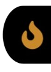
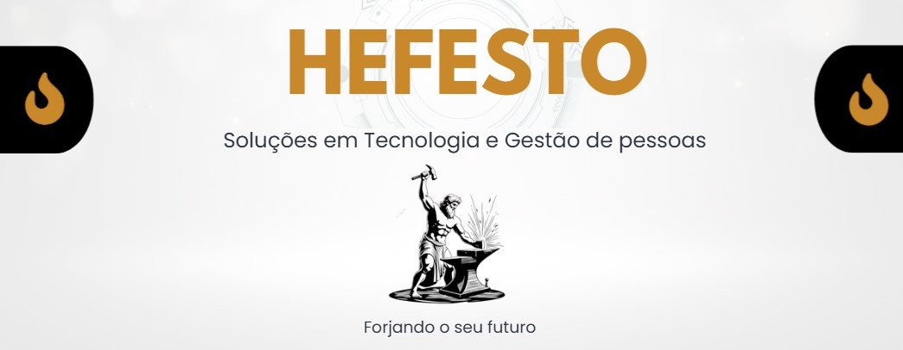

<!DOCTYPE html>
<html lang="pt-BR">
<head>
  <meta charset="UTF-8" />
  <meta name="viewport" content="width=device-width, initial-scale=1.0" />
  <title>Hefesto | Soluções em Tecnologia e Gestão de Pessoas</title>

  <link rel="preconnect" href="https://fonts.googleapis.com">
  <link rel="preconnect" href="https://fonts.gstatic.com" crossorigin>
  <link href="https://fonts.googleapis.com/css2?family=Inter:wght@400;500;600;700;800&display=swap" rel="stylesheet">

  
</head>
<body>
  <header>
    

      <a href="#inicio" class="brand">
        
        
          Hefesto
          Soluções em TI e Gestão de Pessoas
        
      </a>

      <button class="nav-toggle" id="navToggle" aria-label="Abrir menu">☰</button>

      <nav class="nav-links" id="navLinks">
        <a href="#sobre">Sobre</a>
        <a href="#especialidades">Especialidades</a>
        <a href="#mvv">MVV</a>
        <a href="#diferenciais">Diferenciais</a>
        <a href="#projetos">Projetos</a>
        <a href="#contato">Contato</a>
      </nav>
    

  </header>

  <main>
    <section class="hero" id="inicio">
  

    

      
    

    

      <h4 class="hero-title">
        Desenvolvemos, implementamos e aprimoramos N soluções tecnológicas para o sucesso da sua empresa.
      </h4>

      

        <article class="hero-card">
          <h3>Mapeamento</h3>
          

            Identificamos gargalos e oportunidades de automação e melhoria em processos e estratégias.
          

        </article>

        <article class="hero-card">
          <h3>Desenvolvimento Sob Medida</h3>
          

            Criamos soluções adaptadas à realidade da sua operação, com foco em performance, organização e escalabilidade.
          

        </article>

        <article class="hero-card">
          <h3>Integração entre Pessoas e Sistemas</h3>
          

            Conectamos tecnologia, dados e gestão de pessoas para gerar fluidez e apoiar decisões mais inteligentes.
          

        </article>
      

    

  

</section>

    <section class="section" id="especialidades">
      

        

          
especialidades

          <h2 class="section-title">O que fazemos</h2>
          

            Atuamos na interseção entre pessoas, dados e tecnologia, desenvolvendo soluções com sofisticação visual, consistência técnica e foco prático na rotina da empresa.
          

        

        

          <article class="service-card reveal">
            <strong>WebApps</strong>
            
Aplicações web sob medida para otimizar operação, experiência e controle interno.

          </article>

          <article class="service-card reveal">
            <strong>People Analytics</strong>
            
Indicadores, dashboards e leitura estratégica de métricas como headcount, absenteísmo, turnover e NPS.

          </article>

          <article class="service-card reveal">
            <strong>Automação de Processos</strong>
            
Fluxos mais inteligentes com integrações e automações para reduzir esforço manual.

          </article>

          <article class="service-card reveal">
            <strong>Customização de ERP</strong>
            
Desenvolvimento em AdvPL com adaptação do TOTVS Protheus à realidade do negócio.

          </article>

          <article class="service-card reveal">
            <strong>Integração de Sistemas</strong>
            
Conectamos plataformas e dados para gerar uma operação mais centralizada e confiável.

          </article>

          <article class="service-card reveal">
            <strong>Gestão de Pessoas</strong>
            
Onboarding, T&amp;D, recrutamento por competências, DISC, banco de talentos e endomarketing.

          </article>
        

      

    </section>

    <section class="section" id="mvv">
      

        

          

            

              

                
mvv

                <h2 class="section-title" style="margin-bottom: 0;">Nossa missão, visão e valores</h2>
              

              
            

            

              

                <h3>Missão</h3>
                
Transformar tecnologia em vantagem real para empresas que precisam de estrutura, clareza e soluções com propósito.

              

              

                <h3>Visão</h3>
                
Ser referência em soluções tecnológicas integradas à gestão de pessoas, com entregas consistentes, elegantes e duradouras.

              

              

                <h3>Valores</h3>
                <ul class="mvv-values">
                  <li>Cada projeto é construído sob medida, sem soluções genéricas.</li>
                  <li>Acreditamos em tecnologia com alma, porque todo processo impacta pessoas.</li>
                  <li>Valorizamos clareza, consistência, compromisso e profundidade na execução.</li>
                  <li>Entramos na operação para compreender o negócio antes de propor qualquer solução.</li>
                  <li>Evoluímos continuamente para manter a entrega atual, estratégica e sustentável.</li>
                </ul>
              

            

          

        

      

    </section>

    <section class="section" id="diferenciais">
      

        

          
diferenciais

          <h2 class="section-title">Da compreensão humana à tecnologia aplicada</h2>
          

            Nossa força está em unir sensibilidade humana, leitura organizacional e construção técnica. Isso torna a entrega mais profunda, mais alinhada ao contexto e mais eficiente na prática.
          

        

        

          

            

              01
              <h4>Tecnologia</h4>
              
Desenvolvimento de soluções, automações e estruturas digitais com foco em performance e organização.

            

            

              02
              <h4>Psicologia</h4>
              
Base para compreender comportamento, relações, desenvolvimento humano e dinâmicas organizacionais.

            

            

              03
              <h4>RH Estratégico</h4>
              
Aplicação prática em gestão de pessoas, indicadores, rotinas e apoio à tomada de decisão.

            

            

              <a href="#projetos" class="btn btn-primary">Ver projetos</a>
              <a href="https://wa.me/556798338922" class="btn btn-secondary" target="_blank" rel="noreferrer">Fale conosco</a>
            

          

        

      

    </section>

    <section class="section" id="projetos">
      

        

          
projetos

          <h2 class="section-title">Cases em destaque</h2>
          

            Exemplos de como aplicamos tecnologia, análise e visão de negócio para resolver problemas reais com elegância e eficiência.
          

        

        

          <article class="project-card reveal">
            <h3>Automação de Relatórios no Protheus</h3>
            
Desenvolvimento de relatórios personalizados em AdvPL e SQL para reduzir retrabalho e acelerar a leitura de informações estratégicas.

            

              AdvPL
              SQL
              Protheus
            

            <ul class="project-points">
              <li><strong>Problema:</strong> rotinas manuais e baixa padronização.</li>
              <li><strong>Solução:</strong> relatório customizado com regras de negócio.</li>
              <li><strong>Resultado:</strong> mais confiabilidade, organização e agilidade.</li>
            </ul>
          </article>

          <article class="project-card reveal">
            <h3>Dashboard de Indicadores de RH</h3>
            
Construção de dashboards voltados ao acompanhamento de métricas de gestão de pessoas e suporte à tomada de decisão.

            

              Power BI
              SQL
              Analytics
            

            <ul class="project-points">
              <li><strong>Problema:</strong> dados dispersos e pouca visibilidade.</li>
              <li><strong>Solução:</strong> painel centralizado com KPIs relevantes.</li>
              <li><strong>Resultado:</strong> leitura mais rápida e decisões mais claras.</li>
            </ul>
          </article>

          <article class="project-card reveal">
            <h3>Integração entre Pessoas e Processos</h3>
            
Aplicação do olhar psicológico e estratégico na organização de fluxos, comunicação e melhoria contínua da rotina interna.

            

              RH
              Processos
              Estratégia
            

            <ul class="project-points">
              <li><strong>Problema:</strong> gargalos operacionais e pouca fluidez.</li>
              <li><strong>Solução:</strong> estruturação de processos com visão humana.</li>
              <li><strong>Resultado:</strong> mais alinhamento, clareza e eficiência.</li>
            </ul>
          </article>
        

      

    </section>

    <section class="section" id="contato">
      

        

          

            

              
contato

              <h2 class="section-title">Vamos conversar</h2>
              

                Venha construir conosco uma solução pensada com profundidade, estética profissional e impacto real na sua operação.
              

              <a href="https://wa.me/5518996853097" class="btn btn-primary" target="_blank" rel="noreferrer">Entrar em contato</a>
            

            

              

                <strong>Email</strong>
                <a href="mailto:hefesto@outlook.com">hefesto@outlook.com</a>
              

              

                <strong>LinkedIn</strong>
                

                  <a href="https://www.linkedin.com/in/ka-ito/" target="_blank" rel="noreferrer">linkedin.com/in/ka-ito</a>
                  <a href="https://www.linkedin.com/in/victoria-sarti/" target="_blank" rel="noreferrer">linkedin.com/in/victoria-sarti</a>
                

              

              

                <strong>GitHub</strong>

              
 
                <a href="https://github.com/K4-it0" target="_blank" rel="noreferrer">github.com/K4-it0</a>
                             
                <a href="https://github.com/VictoriaCaroline" target="_blank" rel="noreferrer">github.com/VictoriaCaroline</a>
                             
              

            

          

        

      

    </section>
  </main>

  <footer>
    

      
      
© 2026 Hefesto Soluções. Todos os direitos reservados.

    

  </footer>

  
</body>
</html>
